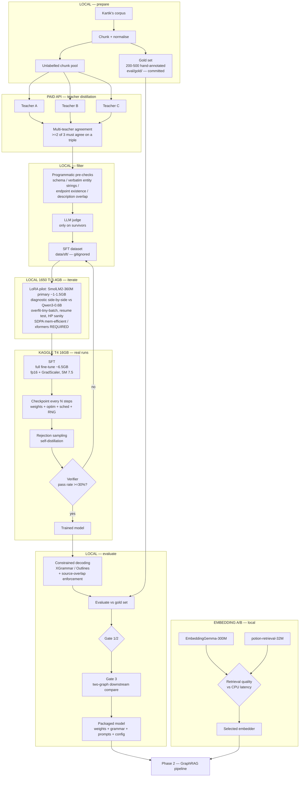
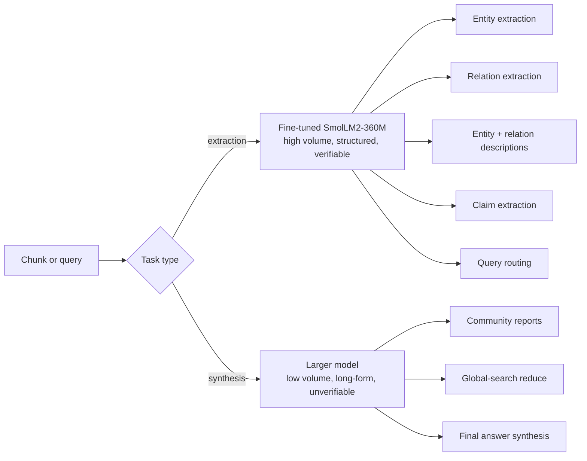

# Phase 1 Architecture

What gets built, where each stage runs, and why the pieces are arranged this way.

Phase 1 produces two artifacts: a **fine-tuned extraction model** and a **selected embedding model**. It is not the GraphRAG pipeline — that is Phase 2. It is the model-production line that Phase 2 will consume.

## Data flow



## Where each stage runs, and why

| Stage | Runs on | Why there |
| --- | --- | --- |
| Chunking, normalisation | Local | Cheap, CPU-bound, touches the raw corpus |
| Gold-set annotation | Local, by hand | Cannot be automated without defeating its purpose |
| Teacher distillation | Paid API | Free tiers cannot produce the volume — see `DATA_STRATEGY.md` |
| Agreement + programmatic filtering | Local | Pure string/set operations, no model needed |
| LLM judge | Paid API, on survivors only | Runs last precisely so it runs on the smallest set |
| **Pilot / debug training (LoRA)** | **Local 1650 Ti** | LoRA on 360M is expected around 1.0–1.5 GB; LoRA on 0.6B is ~2.0–3.0 GB. Get the loop right before spending a Kaggle session |
| **Real training runs (full FT)** | **Kaggle T4 (16 GB)** | Gate numbers come from the shipping full-FT recipe. The 360M full-FT footprint is not measured yet, and the local card is an estimated 25–50× slower |
| Rejection sampling + self-distillation | Kaggle T4 (pilot locally) | Needs generation and training in one session at volume |
| Inference, evaluation, Gate 1/2/3 | Local | This is what the local box is for |
| Embedding A/B | Local (CPU **and** GPU) | CPU latency is the whole point of the potion comparison |

**T4 is SM 7.5**: fp16 with `GradScaler`, no bf16. This is a hardware fact, not a tuning choice, and it propagates into every training config. (The 1650 Ti is SM 7.5 too, so the same rule holds locally.)

## Local vs Kaggle training — the split

The local GPU **is** a training device, deliberately. Kartik has fine-tuned Pythia-410M on this card before; the memory budget works out:

| Setup | VRAM | Fits 3.4 GB? |
| --- | --- | --- |
| **LoRA on SmolLM2-360M (the primary)** | **~1.0–1.5 GB** | **yes, comfortably** |
| LoRA on Qwen3-0.6B | ~2.0–3.0 GB | yes |
| Full fine-tune of Qwen3-0.6B | ~6.5 GB | no |
| Full fine-tune of SmolLM2-360M | not measured | unknown — **measure before assuming** |

The 360M full-FT footprint is the one number missing here. It is smaller than the 0.6B's 6.5 GB, but "smaller" is not "fits" — measure it rather than assuming, because if full FT of the 360M *does* fit locally, that changes where real runs go.

So the constraint was never simply memory. It is two separate things: **wall-clock**, and **LoRA vs full fine-tune**.

**Rule of thumb for where a run goes:**

| Run type | Where | Why |
| --- | --- | --- |
| Overfit-a-tiny-batch sanity check | Local LoRA | Should take minutes. If loss doesn't collapse on 20 examples, the loop is broken |
| Pipeline debugging, resume-path test | Local LoRA | Kill and resume a short run here, not on Kaggle |
| Hyperparameter sanity checks | Local LoRA | Order-of-magnitude LR and batch sizing |
| Pilot on a 1–5k subset | Local LoRA | Confirms data format, prompt, and grammar end to end |
| Full SFT on the real dataset | Kaggle, full FT | The 360M full-FT footprint is not measured yet; Kaggle remains the default for gate runs until a committed memory test proves local full FT is viable |
| Rejection sampling at volume | Kaggle | Generation throughput |
| Anything producing a gate number | Kaggle, full FT | Gate numbers come from the real configuration |

Getting the training loop correct locally before spending a Kaggle session is **good practice, not a compromise**. A Kaggle session burned on a bug that a 3-minute local run would have caught is the expensive mistake.

**Why the real runs are full fine-tune, not LoRA.** The LoRA-Learns-Less evidence favours full fine-tuning for **task shift** — and this is task shift, not style adaptation. The model is being taught a new structured output format and a new extraction behaviour, which is exactly the regime where LoRA's low-rank update underperforms. LoRA is the iteration tool here; it is not the shipping recipe.

### The real local gotcha: context length, not parameters

Parameter count is not what will blow the local 3.4 GB. **Attention memory at long sequence length is.**

The selected primary model's native context budget is **8192 tokens**: Hugging Face `AutoConfig` for `HuggingFaceTB/SmolLM2-360M-Instruct` reports `max_position_embeddings` 8192. That is the target for GraphRAG capability pilots, because extraction, reference-grounded QA, and context-aware summarization all need the same long-context envelope the production flow will use.

The 1650 Ti is SM 7.5, which **FlashAttention-2 does not support**. With naive attention, sequence length 4096 costs roughly **537 MB per layer** — which overruns the card regardless of how small the LoRA adapter is.

This matters specifically for this project because GraphRAG extraction prompts are long: ~1,200-token chunks plus few-shot examples plus a schema. These are not 512-token training samples.

**Requirement, not a suggestion:** local training must explicitly use **PyTorch SDPA's memory-efficient backend** or **xformers**. Enable it, and assert it is actually active — silently falling back to the naive path is the failure mode, because it fails as an OOM that looks like "the model is too big" rather than "attention picked the wrong kernel."

If a local 8192-token training probe does not fit, do not silently shrink the GraphRAG capability pilot. Either move that pilot to Kaggle or label the shorter run as smoke-only.

### Kaggle notebook requirements

Designed in from the start, not retrofitted after a lost session. These are requirements.

**1. Sessions complete inside the limit by design.** Target a **graceful stop at 8–9 hours** against Kaggle's cap. The stop is triggered by an **elapsed-time watchdog inside the training loop** — checked every step — not by estimating beforehand that the run will fit. Hope is not a scheduling mechanism.

**2. On stop, the shutdown sequence is fixed:**

1. finish the current step (do not abort mid-step)
2. save model weights
3. save optimizer state
4. save scheduler state
5. save RNG state
6. save the step and epoch counters
7. write a **resume manifest** — what was saved, which step, which data position, which config
8. exit cleanly, so Kaggle preserves `/kaggle/working`

An unclean exit can lose the outputs, which turns a graceful stop into a lost session anyway.

**3. Resume is first-class from day one.** A run started from a checkpoint must continue **the LR schedule and the data ordering** correctly — not silently restart them.

This is the classic bug and it deserves naming: a resumed run that restarts the LR schedule from warmup, or reshuffles the data from epoch zero, **produces a plausible loss curve and an invalid result**. It does not crash. It does not warn. It just quietly trains a different recipe than the one you think you ran. Test resume explicitly — kill a short local run, resume it, and confirm the LR and the data position both continue rather than reset.

**4. Checkpoint periodically as well as at the time limit**, so an unexpected disconnect costs at most N steps. The time-limit checkpoint handles the expected ending; periodic checkpoints handle the unexpected one.

**5. The Kaggle notebook is generated from locally-validated code, not written independently.**

The workflow is one-directional:

```
validate the training loop locally with LoRA on a small subset
          |
          v
generate the Kaggle notebook from that validated code
```

**Divergence between the local and Kaggle training paths is how these projects break.** Two separately-written training loops drift — a different tokenizer flag here, a different collator there — and the resulting bug shows up as "the Kaggle run performed worse" rather than as an error. The local loop is the source of truth; the notebook is a thin driver over it (see `AGENTS.md` §2 and §7).

### QLoRA is not worth it at this size

4-bit quantisation saves roughly **540 MB** on a 0.72 GB base model, and costs dequantisation overhead on every forward pass. At this model scale that trade is not worth making.

**Prefer plain LoRA locally.** QLoRA earns its keep at 7B+, where the base weights dominate the memory budget. Here they do not — attention does.

## The two-model split



The line is **extraction vs synthesis**, not index-time vs query-time.

Three properties decide which side a task falls on:

1. **Volume.** Extraction is per-chunk and scales with corpus size. Synthesis is per-community or per-query. The expensive-per-call model belongs on the low-volume side.
2. **Structure.** Extraction has a schema, so constrained decoding applies and a small model can be held to the format. Synthesis is free prose, where a small model's weaknesses show directly.
3. **Verifiability.** An extracted entity either appears in the chunk or does not. A community report's quality has no such check — which means no verifier, which means no rejection sampling, which means fine-tuning it is a much harder problem with a much worse feedback loop.

Query routing joins the small model despite being query-time: it is a short classification with a fixed label set, it is latency-sensitive, and it is verifiable against a labelled routing set.

## Where constrained decoding sits

Constrained decoding is **inference-time only**. Training sees ordinary text; the grammar is applied at generation.

It applies in three places:

1. **Rejection sampling** (Kaggle) — samples are generated under the grammar so the verifier is judging content, not format.
2. **Evaluation** (local) — Gate metrics are measured with the grammar on, because that is how the model will run.
3. **Phase 2 production** (local) — the packaged model ships with its grammar.

Two consequences:

- **Parse rate is 100% by construction and therefore meaningless.** It is not a gate metric and must not be reported as a result. Gate on semantic value accuracy.
- **The grammar is part of the model artifact.** A checkpoint without its grammar file and its prompt templates is not a deliverable. They version together.

**Source-overlap enforcement** is a second decode-time constraint, layered on the grammar, and it is the primary mitigation for the top project risk. Descriptions are trained as spans or near-spans of the source chunk, and at decode time a description that falls below the overlap threshold with its chunk cannot be emitted. Grammar constrains *shape*; overlap constrains *groundedness*. Both are needed — a perfectly-shaped fabricated description is exactly the failure mode that poisons the graph.

## Embedding model selection

Two candidates, selected by A/B rather than by assumption:

- **EmbeddingGemma-300M** — primary. Higher expected retrieval quality.
- **potion-retrieval-32M** — the serious alternative. Roughly **200× faster on CPU**.

The hypothesis worth testing: in GraphRAG, a large share of retrieval load is carried by **graph traversal**, not by vector similarity. Vector search finds entry points; the graph does the rest. If that holds on this corpus, the quality difference between the two embedders may not show up in end-to-end answer quality at all — and a 200× CPU speedup with no measurable cost is a very large win for a locally-run pipeline.

**A/B protocol:**

1. Build the graph **once**, with the Phase 1 extraction model. Graph structure is held constant.
2. Embed the same nodes/descriptions with each candidate.
3. Run the same query set end to end through both, measuring answer quality — not embedding-benchmark scores.
4. Measure CPU and GPU latency at Phase 2's realistic batch sizes.
5. Choose on the end-to-end curve. If quality is within noise, take the fast one.

Measuring this on an embedding leaderboard instead of end to end would answer a different question than the one that matters.

## Packaged model artifact

Phase 1's output is a directory, not a weights file:

```
weights/              fine-tuned SmolLM2-360M (primary)
grammar/              XGrammar/Outlines schema definitions
prompts/              exact prompt templates used at eval time
config.yaml           decode params, overlap threshold, batch size
metrics.json          Gate 1/2/3 results + gold-set hash
env.json              commit SHA, package versions, GPU
```

Anything less is not reproducible and does not satisfy the `AGENTS.md` review bar.
